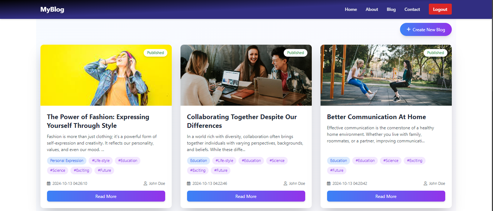

# 🌟 My-Blog Application 🌟

<div align="center">
   

---
<div align="center">
  Made with ❤️ by [Ahmed Al-Sanadi]
  
  ⭐ Star this repo if you find it helpful!
</div>


</div>

## ✨ Overview
Welcome to **My-Blog**, a PHP-based blog platform where users can create, manage, and explore blog posts with ease. With a simple and intuitive interface, anyone can share their thoughts and ideas with the world! 🌍

## ✨ Features

- 🔐 **User Authentication**: Sign up, log in, and log out with secure authentication.
- ✏️ **Blog Management**: Create, edit, and delete blog posts seamlessly.
- 🖼️ **Image Upload**: Upload images for your blog posts (supports JPG, PNG, GIF formats).
- 🏷️ **Categories & Tags**: Add categories and tags to organize your blog posts.
- 📱 **Responsive Design**: The design adapts beautifully to different devices.
- 🔒 **Security First**: We prioritize your security with input sanitization, hashed passwords, and error handling.

---

## 📚 Table of Contents
- [Installation](#installation)
- [Database Setup](#database-setup)
- [Project Structure](#project-structure)
- [Routes](#routes)
- [Controllers](#controllers)
- [Contributing](#contributing)
- [License](#-license)

---

## ⚙️ Installation

1. **Clone the Repository**: 
   ```bash
   git clone https://github.com/ahmedalsanadi/my-blog.git
   cd my-blog
   ```

2. **Install Required PHP Extensions**:  
   Ensure PHP environment has the `PDO` extension for MySQL.

3. **Configure Database**:  
   Modify the `db.php` file in `app/config/` with your database details:
   ```php
   const DB_HOST = 'localhost';
   const DB_USER = 'root';
   const DB_PASSWORD = '';
   const DB_NAME = 'blog';
   ```

4. **Import Database**:  
   Run the following command to import the database schema and sample data:
   ```bash
   mysql -u root -p blog < ./Database/blog.sql
   ```

5. **Run the App**:  
   Open your browser and navigate to `http://localhost/my-blog`.

---

## 🗂️ Database Setup

- The database schema is located in the `./Database/blog.sql` file.
- Import the schema with:
  ```sql
  SOURCE ./Database/blog.sql;
  ```

---

## 📁 Project Structure

```bash
my-blog/
├── app/
│   ├── config/              # Configuration files
│   ├── controllers/         # Handles logic for blog and user
│   ├── models/              # Models interacting with the database
│   └── router/              # Route handler
├── pages/                   # Static pages
├── views/                   # HTML templates
├── uploads/                 # Directory for blog images
├── Database/                # Database schema
└── index.php                # Main entry point
```

---

## 🌐 Routes

Here are the key routes of the application:

- **`/home`**: View all blogs on the homepage.
- **`/about`**: Learn more about this blog platform.
- **`/contact`**: Contact form for reaching out.
- **`/sign-in`**: Log in to your account.
- **`/sign-up`**: Register a new account.
- **`/blog/create`**: Create a new blog post (requires login).
- **`/blog/edit?id={id}`**: Edit an existing blog post.
- **`/blog/delete?id={id}`**: Delete a blog post.

---

## 🛠️ Controllers

- **BlogController**: Handles actions like listing blogs, creating, editing, and deleting.
- **UserController**: Manages user authentication (sign-in, sign-up, logout).

---

## 🤝 Contributing

Contributions are welcome! Follow these steps to contribute:

1. Fork this repo.
2. Create a new branch (`git checkout -b feature/my-feature`).
3. Commit your changes (`git commit -m 'Added some feature'`).
4. Push to the branch (`git push origin feature/my-feature`).
5. Open a pull request.

---

## 📜 License

This project is licensed under the **MIT License**. See the [LICENSE](./LICENSE) file for more details.

---

## 🙌 Credits

Made with ❤️ by [Ahmed Al-Sanadi]


⭐ **Star** this repo if you find it useful!
